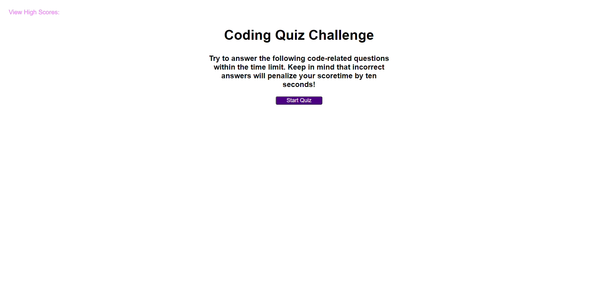

# code-quiz
## Description
This application is a quiz on some JavaScript fundamentals.  The purpose is to give some practice and an assessment to new coders on their basic JavaScript skills.  The quiz is 5 questions long and has a timer set for 75 seconds.  A correct answer will go to the next question while an incorrect answer will subtract 10 seconds of the time.  The score at the end is the time left on the timer.

## Screenshot

## Link to the deployed application
[code-quiz deployed application](https://srwagner916.github.io/code-quiz/)

## Link to the GitHub repository
[code-quiz GitHub repo](https://github.com/srwagner916/code-quiz)

### Shay Wagner